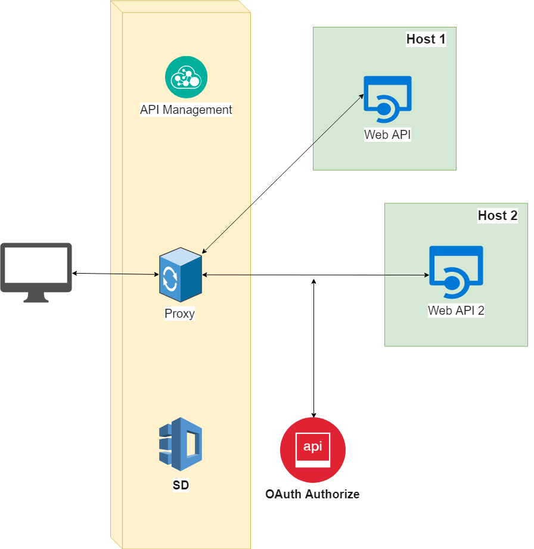

# Architecture

System architecture as a global |  gAPI functional architecture
:-------------------------:|:-------------------------:
 |  

gAPI is composed by several components:

1. Service Discovery (SD) - where all APIs and MicroServices are stored. The storage can be done to MongoDB or JSON file (to reduce dependencies)
2. Request Logging - this component is responsible for logging all  requests information. It uses RabbitMQ to publish new logs to a queue. This component also contains a listener/consumer which is listening from RabbitMQ and stores logs to ElasticSearch
3. API - allows to access gAPI features:
    * Register, list, find or delete a MicroService
    * Get request analytics
    * Authenticate user on gAPI services
4. OAuth authenticator - responsible for authenticating users on MicroServices. This component uses an external oauth server to validate token.
5. Proxy - responsible for requesting the correct microservice when a new requests comes.
6. Authentication - gAPI Authentication service.