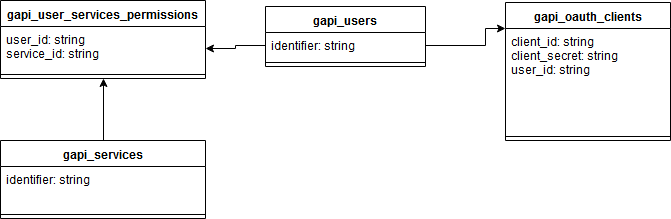

# User Permissions

gAPI has a module that enables to give access permission to users. This way, APIs can only be accessed by authorized users.

## Enable/Disable

This module can be enabled or disabled by adding a new entry to the JSON configuration file:

```
"ServicesPermissionsEnabled": false
```

## How it works

When the module is enabled, a token or client id header is required to be sent on the http request.

Each user has one or more Client Ids and Client secrets associated.

There are two ways of validating the user is allowed to access an API:

1. GAPI_CLIENT_ID header is passed with the user client id. This header allows us to valdiate the user is allow to access the api.
2. The JWT token passed on the authorization header is analysed and it contains a _client_id_ claim inside, which corresponds to the gAPI user's client id

Permissions are checked on proxy service.

## Client Id and Client Secret table

Client id's and client secret's are stored on _gapi_oauth_clients_ table.
This table is linked to the _gapi_users_ table by the _user_id_ column.

## Service Permissions table

Permissions are stored in _gapi_user_services_permissions_ table, which links _gapi_services_ and _gapi_users_ table.


