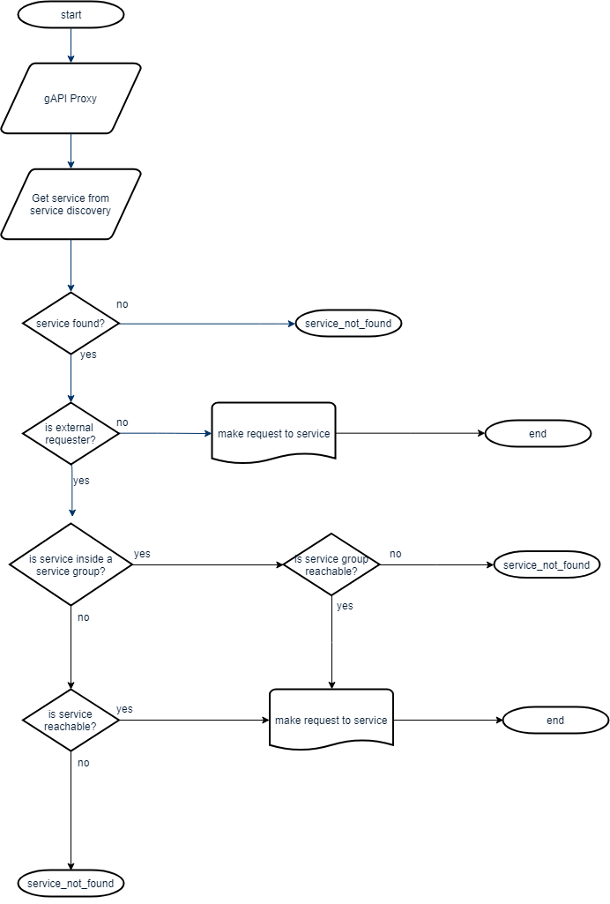

# Reachability

gAPI enables services to be reachable or not reachable from external services.

When a service is not reachable, only other services can communicate with it.

## Services Groups

In order to facilitate the management of reachability, there is the option to create groups of services.

With these groups, all services inside the group will share the same state in terms of reachability.

## Configuration

Each service contains a field called _IsReachable_ which indicates if the service is reachable from external services or not.

In order to make the service reachable, this field must be TRUE.

## Flow

